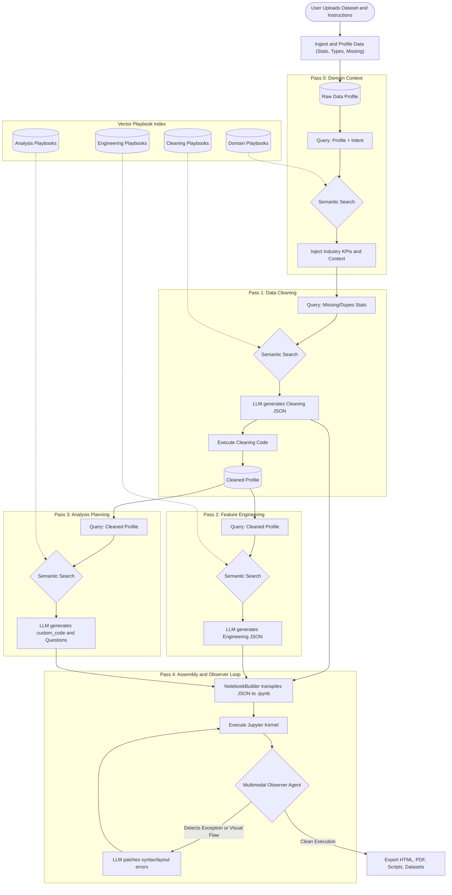

# ⚡ First Pass: Autonomous Agentic RAG Data Scientist

[](https://www.python.org/downloads/)
[](https://nourian.dev/projects#first-pass)
[](https://cloud.google.com/run)
[](https://deepmind.google/technologies/gemini/)

**First Pass** is an autonomous AI data scientist designed to automate the heavy lifting of exploratory data analysis (EDA). Built with a specialized **4-stage Agentic RAG architecture**, the system dynamically ingests raw datasets, retrieves domain-specific analysis strategies, and generates fully executed Jupyter Notebooks without human intervention. 

Stop writing boilerplate code to clean missing values, parse dates, and plot correlation matrices. Upload your data, and let First Pass do the rest.

---

## 🎯 Key Capabilities

* **Agentic Playbook RAG:** Dynamically maps your dataset's statistical profile to a vector database of expert data science "playbooks" (e.g., retrieving advanced time-series analysis templates when temporal columns are detected).
* **Autonomous Execution:** A custom `NotebookBuilder` engine transpiles LLM-generated JSON execution plans directly into raw `.ipynb` files.
* **Multimodal Self-Correction:** An integrated Vision-Language Observer agent supervises notebook execution, iteratively detecting and patching Python runtime exceptions and malformed chart layouts on the fly.
* **Zero-Configuration UI:** A polished Streamlit interface offering multi-format data ingestion (`.csv`, `.parquet`, `.xlsx`) and instant reporting exports (HTML, PDF, DOCX).
* **Production-Ready:** Fully Dockerized and configured for zero-to-scale deployment on Google Cloud Run.

---

## 🧠 System Architecture

First Pass operates on a sequential, multi-agent pipeline designed to mimic the workflow of a human data scientist:

1. **Pass 0 (Domain Context):** Injects industry-specific KPIs and best practices based on the dataset's initial statistical profile.
2. **Pass 1 (Data Cleaning):** Intelligently handles missing values, standardizes types, and mathematically imputes anomalies in-memory.
3. **Pass 2 (Feature Engineering):** Mathematically transforms features (e.g., binning, scaling, temporal extraction) to surface deeper signals.
4. **Pass 3 (Analysis Planning):** Formulates targeted business questions and generates consultant-grade Matplotlib/Seaborn Python code using retrieved templates.
5. **Pass 4 (Observer Loop):** Safely executes the compiled notebook in a secure Jupyter kernel, utilizing an AI observer to catch and resolve tracebacks.

<details open>
<summary><b>View Pipeline Schematic</b></summary>


</details>

---

## 🚀 Getting Started

### Local Installation

1. **Clone the repository:**
   ```bash
   git clone https://github.com/arvinourian/first-pass.git
   cd first-pass
   ```

2. **Install dependencies:**
   ```bash
   pip install -r requirements.txt
   ```

3. **Configure the Environment:**
   Create a `.env` file in the root directory and add your Gemini API key:
   ```env
   GEMINI_API_KEY="your_gemini_api_key_here"
   ```

4. **Launch the Web Interface:**
   ```bash
   streamlit run app.py
   ```

### Docker Deployment (Google Cloud Run)

First Pass is production-ready for Google Cloud Run or any Linux-based container orchestration system. The included `Dockerfile` automatically installs the necessary Chromium and Pandoc system dependencies for headless PDF and DOCX reporting.

```bash
docker build -t first-pass .
docker run -p 8080:8080 --env GEMINI_API_KEY="your_api_key" first-pass
```

---

## 📁 Repository Structure

```text
First Pass/
├── app.py                           # Streamlit web application entrypoint
├── batch_run.py                     # Headless bulk execution script for pipelines
├── requirements.txt                 # Python dependencies
├── Dockerfile                       # Production containerization script
├── first_pass/                      # Core backend package
│   ├── ingest.py                    # Data loaders (CSV, Excel, Parquet)
│   ├── profile.py                   # Statistical dataset profiling 
│   ├── notebook_builder.py          # Jupyter transpiler and kernel execution
│   ├── export.py                    # Cross-platform HTML, PDF, DOCX utilities
│   ├── telemetry.py                 # Telemetry and logging module
│   ├── llm/                         # LLM agent logic (Planner, Observer, Prompts)
│   ├── retrieval/                   # FAISS vector database index for playbooks
│   └── templates/                   # Repository of Pandas/Seaborn code templates
├── playbooks/                       # Markdown vector index (Domain, Cleaning, Analysis)
├── Sample Inputs/                   # Example raw datasets and context guides
└── Sample Outputs/                  # Example generated HTML reports
```

## 📝 License
This project is open-source and available under the [MIT License](LICENSE).
